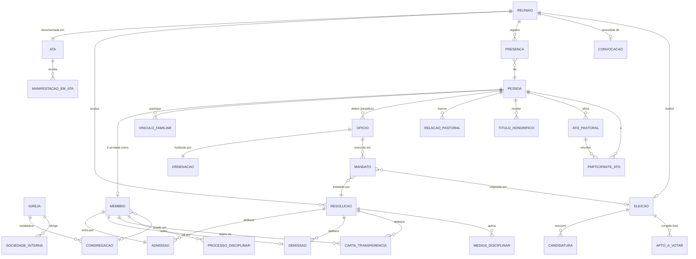

# 04 — Modelo de entidades (v3)

Modelo de domínio da IPA derivado da CI/IPB. Cada entidade traz a(s) regra(s) `RN-XX-00` do doc 03 que a justificam.

**Legenda de prioridade**: 🟢 MVP · 🟡 v2 · ⚪ backlog

---

## Changelog v2 → v3

Ajustes decorrentes das ressalvas do usuário e do perfil dos dados reais (doc 12).

| # | Mudança | Origem |
|---|---|---|
| 1 | `Membro.categoria` vem da coluna **`membro`** do CSV, **nunca** derivada de `data_profissao_fe` | Doc 12 §3.1 — só 33% dos comungantes têm o campo; a derivação erraria 50% |
| 2 | **`Pessoa.sexo` passa a opcional** | Doc 12 §5.2 — falta em 860 registros; obrigatoriedade inviabiliza a importação |
| 3 | **`Membro.numeroRol` passa a texto**, formato `AAAA` + sequência | Doc 12 §4 — o padrão em uso é `20181567`, não inteiro sequencial (revisa B3-a) |
| 4 | 🆕 `Membro.pendenciaRevisao` + `Pessoa.dadosInferidos` | Doc 12 §5 — três filas de revisão (521 sem categoria, 860 sem sexo, 34 duplicatas) |
| 5 | `Oficio` passa a ser **importável do CSV** (coluna `oficial`, com disponibilidade) | Doc 12 §3.2 |
| 6 | `OrganizacaoInterna` volta a **🟡**; ministérios informais viram `Designacao` | Ressalva do usuário — não há sociedade com estatuto na IPA |
| 7 | `EscolaDominical`, `TurmaEBD`, `AtuacaoEBD` → **⚪ backlog** | Ressalva do usuário |
| 8 | `RelatorioFinanceiroAnual` → **🟡** | Não bloqueia a E1 |
| 9 | Estatística **deixa de ser validada** contra o relatório 2025 | Ressalva do usuário — os números não batem com o rol |
| 10 | 🆕 `Membro.categoria` admite `NAO_DEFINIDO`; `Pessoa` pode existir **sem** `Membro` (622 "Não membro") | Doc 12 §3.1 |

---

## Changelog v1 → v2

Ajustes decorrentes das decisões do doc 07, do relatório oficial (doc 08) e do CSV de origem (doc 09).

| # | Mudança | Origem |
|---|---|---|
| 1 | `Congregacao` promovida a 🟢 | Decisão A3-b: 2 congregações + 1 ponto de pregação existem hoje |
| 2 | `SociedadeInterna` substituída por **`OrganizacaoInterna`** com dois eixos (`natureza` × `categoriaIPB`), promovida a 🟢 | Doc 08 §3.3 — o formulário exige contagem de departamentos sem estatuto |
| 3 | 🆕 **`EscolaDominical`**, `TurmaEBD`, `AtuacaoEBD` | Doc 08 §6.1 — Seção II do formulário |
| 4 | 🆕 **`VinculoMinisterial`** (licenciados e candidatos) | Doc 08 §3.1 |
| 5 | 🆕 **`RelatorioFinanceiroAnual`** (totais anuais, sem módulo de finanças) | Doc 08 §5 — preserva a decisão A5-a |
| 6 | `Demissao.forma` ganha `ORDENACAO_AO_MINISTERIO` e `MOVIMENTO_PARA_ROL_SEPARADO` | Doc 08 §4.1 — linhas do formulário oficial |
| 7 | `AtoPastoral.oficianteId` passa a **opcional**, com `oficianteNomeExterno` e `igrejaExternaNome` | Doc 09 §2.5 — atos históricos de outras igrejas |
| 8 | `Igreja` ganha siglas, caixa postal, telefones, e-mail e site | Doc 08 §2 — Seção I do formulário |
| 9 | `Pessoa` ganha `naturalidade`, `idLegado` e campos-texto de filiação/cônjuge | Doc 09 §2.1 e §2.6 |
| 10 | `EstatisticaAnual` reescrita para espelhar o formulário CSM-IPB campo a campo | Doc 08 §4 |
| 11 | Regime excepcional do Art. 76 §1º rebaixado a ⚪ | 21 presbíteros — nunca se aplica (doc 08 §1) |
| 12 | Toda contagem estatística passa a ser segmentada por **sexo** | Doc 08 §4 |

---

## Princípios estruturais (leia antes das tabelas)

1. **`Pessoa` é o registro único.** Membro, presbítero, diácono, pastor, funcionário e visitante são **papéis** ligados à mesma pessoa. Nunca duplicar pessoa por papel.
2. **Papel tem começo e fim, e é histórico.** Nada de `is_presbitero: boolean`. Toda vinculação é uma linha com `dataInicio`/`dataFim` e motivo.
3. **Mudança de estado que a CI manda registrar vira evento imutável**, não sobrescrita de campo. `Membro.situacao` é *derivado* dos eventos de admissão/demissão/disciplina.
4. **Todo ato oficial aponta para a reunião que o originou** (`Resolucao`), e a reunião aponta para a `Ata`. Este é o eixo probatório do sistema: nada existe eclesiasticamente sem ata.
5. **Fronteira conciliar é campo, não fluxo.** Aprovações do Presbitério entram como `aprovadoPeloPresbiterioEm` + número do documento. O sistema nunca tenta gerenciar o Presbitério.

---

## Diagrama — núcleo



---

## 1. Núcleo — pessoas

### 🟢 `Igreja` (singleton)
> RN-IGR-01/03/04

| Campo | Tipo | Obs |
|---|---|---|
| `nome` | texto | "Igreja Presbiteriana de Anápolis" |
| `cnpj` | texto | RN-IGR-03 — `00.045.369/0001-10` |
| `dataOrganizacao` | data | `14/07/1953` (CI Art. 5º) |
| `presbiterioNome` / `presbiterioSigla` | texto | fronteira — "Presbitério de Anápolis" / `PANA` |
| `sinodoNome` / `sinodoSigla` | texto | fronteira — "Sínodo de Anápolis" / `SAN` |
| `endereco` | embutido | |
| `caixaPostal` / `caixaPostalCep` | texto | Seção I do formulário |
| `telefones[]` | lista | **lista**, não campo único |
| `email` / `site` | texto | Seção I do formulário |
| `estatutoVigenteUrl` / `estatutoAprovadoEm` | arquivo/data | RN-ASM-03 *c* |

*Campos de identificação alinhados ao formulário CSM-IPB 2021 v8.0, Seção I (doc 08 §2).*

*Singleton porque o sistema é mono-igreja. Manter como tabela de 1 linha, não como constante em código — facilita replicar para outra igreja depois.*

### 🟢 `Pessoa`
> Base de todos os papéis. RN-MEM-01, RN-PAS-15

| Campo | Tipo | Obs |
|---|---|---|
| `nomeCompleto` | texto | |
| `dataNascimento` | data | dirige RN-MEM-04 (18 anos), RN-MEM-21 *c* |
| `sexo` | enum M/F, **opcional** | Necessário para RN-OFI-03 e para a estatística, mas **falta em 860 registros reais** — obrigatoriedade inviabilizaria a importação. Vira pendência de revisão, não erro |
| `sexoInferido` | booleano | quando deduzido do prenome (doc 12 §5.2) |
| `naturalidade` | texto | do CSV de origem |
| `estadoCivil` | enum | |
| `civilmenteCapaz` | booleano | RN-MEM-04, RN-ASM-04 |
| `cpf`, `rg` | texto | |
| `contatos` | lista | telefone, e-mail, WhatsApp |
| `endereco` | embutido | usado em RN-MEM-12 (residência nos limites da igreja) |
| `profissao`, `profissaoInformada`, `escolaridade` | texto | do CSV de origem |
| `nomePaiTexto`, `nomeMaeTexto`, `nomeConjugeTexto` | texto | **fallback** quando o casamento por nome falha na importação (doc 09 §2.6) |
| `dataCasamento` | data | do CSV de origem |
| `dataFalecimento` | data | dispara RN-MEM-20 *f* |
| `foto` | arquivo | 🟡 |
| `observacoes` | texto | |
| `idLegado` | texto | chave da planilha de origem — preservar para reimportação e auditoria |

### 🟢 `VinculoFamiliar`
> RN-MEM-11 *a*/*b*, RN-TRF-03, RN-ATO-04 — a CI exige saber quem são **pais ou responsáveis** do não comungante

| Campo | Tipo |
|---|---|
| `pessoaId` / `relacionadoId` | ref Pessoa |
| `tipo` | enum: PAI, MAE, RESPONSAVEL_LEGAL, CONJUGE, FILHO |
| `menorSobGuarda` | booleano (CI Arts. 2º, 4º, 13 §3º) |
| `vigenteDe` / `vigenteAte` | data |

### 🟡 `Funcionario`
> RN-CON-28 (Art. 83 *i* fala em "oficiais **e funcionários**")

`pessoaId`, `cargo`, `regimeContratacao`, `admissaoEm`, `desligamentoEm`. Distinto de oficial: é vínculo trabalhista, não eclesiástico.

---

## 2. Membresia

### 🟢 `Membro`
> RN-MEM-01 a RN-MEM-08, RN-CON-30

| Campo | Tipo | Obs |
|---|---|---|
| `pessoaId` | ref | 1:1 — uma pessoa tem no máximo um registro de membro. **Nem toda `Pessoa` tem `Membro`**: 622 registros do CSV são "Não membro" |
| `numeroRol` | **texto** | Formato real em uso: `AAAA` + sequência (`20181567`). Permanente, nunca reutilizado. Preenchido em 63% do rol — ver P14 |
| `categoria` | enum | `COMUNGANTE` \| `NAO_COMUNGANTE` \| **`NAO_DEFINIDO`** — RN-MEM-02. **Vem da coluna `membro`, nunca de `data_profissao_fe`** (doc 12 §3.1) |
| `categoriaInferida` | booleano | quando deduzida da forma de admissão na importação (P11) |
| `pendenciaRevisao` | booleano | fila de trabalho: mapeia `situacao = 'Revisar'` (99) e as inconsistências detectadas |
| `situacao` | enum **derivado** | `ATIVO` \| `EM_DISCIPLINA` \| `ROL_SEPARADO` \| `TRANSFERENCIA_EM_CURSO` \| `DEMITIDO` |
| `congregacaoId` | ref, opcional | lotação — RN-CNG-04 |
| `dataBatismo` | data | RN-MEM-01 |
| `dataProfissaoFe` | data | preenchida ao virar comungante |
| `dataAdmissao` | data | denormalizado da última `Admissao` |
| `dataDemissao` | data | denormalizado da `Demissao` |
| `emPlenaComunhao` | booleano **derivado** | RN-MEM-06, RN-ELE-04 — ver regra abaixo |
| `ataAdmissaoLegado` | texto | nº/data da ata de admissão vinda da planilha; **não** vincula a `Ata` (decisão A2-a) |
| `idLegado` | texto | rastreio da migração |

⚠️ **`situacao = ROL_SEPARADO` não conta como membro ativo** na estatística. O formulário oficial lista "Rol Separado" entre as **demissões** (doc 08 §4.1) — entrar no rol separado é uma saída da contagem de comungantes, não um estado paralelo.

**`emPlenaComunhao` = `categoria == COMUNGANTE` E `situacao == ATIVO` E não existe `MedidaDisciplinar` vigente que suspenda privilégios.**
*(`NAO_DEFINIDO` nunca está em plena comunhão — os 521 registros sem categoria ficam fora de listas de voto e elegibilidade até serem classificados.)*
Nunca é campo editável. É a checagem mais usada do sistema inteiro (voto, elegibilidade, Ceia, apresentar filho ao batismo, compor assembleia).

**Campos derivados úteis para elegibilidade** (calcular, não armazenar):
`mesesDesdeAdmissao` (RN-MEM-05), `idade` (RN-MEM-04), `elegivelACargoEletivo`, `elegivelAOficialato` (RN-ELE-05).

### 🟢 `Admissao` (evento)
> RN-MEM-10, RN-MEM-11, RN-MEM-15

| Campo | Tipo |
|---|---|
| `membroId` | ref |
| `data` | data |
| `forma` | enum — comungante: `PROFISSAO_FE` \| `PROFISSAO_FE_E_BATISMO` \| `CARTA_TRANSFERENCIA` \| `JURISDICAO_A_PEDIDO` \| `JURISDICAO_EX_OFFICIO` \| `RESTAURACAO` \| `DESIGNACAO_PRESBITERIO`; não comungante: `BATISMO_INFANTIL` \| `TRANSFERENCIA_DOS_PAIS` \| `JURISDICAO_SOBRE_OS_PAIS` |
| `resolucaoId` | ref | ato do Conselho que admitiu — RN-MEM-15 |
| `igrejaOrigemNome` | texto | quando por carta/jurisdição |
| `cartaId` | ref, opcional | carta recebida |
| `documentoPedido` | arquivo | obrigatório na jurisdição a pedido — RN-MEM-13 |
| `atoPastoralId` | ref, opcional | batismo/profissão de fé correspondente |

### 🟢 `Demissao` (evento)
> RN-MEM-20, RN-MEM-21, RN-MEM-23

| Campo | Tipo |
|---|---|
| `membroId`, `data` | |
| `forma` | enum — `EXCLUSAO_DISCIPLINA` \| `EXCLUSAO_A_PEDIDO` \| `EXCLUSAO_POR_AUSENCIA` \| `CARTA_TRANSFERENCIA` \| `JURISDICAO_ASSUMIDA_POR_OUTRA` \| `FALECIMENTO` \| **`ORDENACAO_AO_MINISTERIO`** \| **`MOVIMENTO_PARA_ROL_SEPARADO`** \| `MAIORIDADE_18` \| `PROFISSAO_FE` \| `SOLICITACAO_DOS_PAIS` |
| `resolucaoId` | ref |
| `igrejaDestinoNome` | texto |
| `motivo` | texto |
| `origemMigracao` | booleano | true quando importado sem resolução vinculada |

*Nota: `MAIORIDADE_18` e `PROFISSAO_FE` só se aplicam a não comungantes (RN-MEM-21). No caso de profissão de fé, é demissão do rol de não comungantes **seguida de admissão** no de comungantes — o sistema deve fazer os dois num só fluxo.*

**Duas formas adicionadas na v2, ambas linhas do formulário oficial (doc 08 §4.1):**
- `ORDENACAO_AO_MINISTERIO` — membro ordenado ministro passa ao rol do Presbitério (RN-MEM-24 / CI Art. 23 §3º). Era tratado como fronteira informativa na v1; é saída do rol.
- `MOVIMENTO_PARA_ROL_SEPARADO` — a entrada no rol separado subtrai da contagem de comungantes (RN-MEM-23). Se a pessoa for depois localizada, gerar `Admissao(RESTAURACAO)`.

⚠️ **Mapeamento para o formulário**: o relatório do Presbitério funde as três exclusões numa linha só ("Exclusão") e as duas jurisdições em outra ("Jurisdição"). O modelo guarda a forma **granular** da Constituição e agrega na hora de emitir — nunca o contrário.

### 🟢 `CartaDeTransferencia`
> RN-TRF-01 a RN-TRF-08 — **a entidade mais mal modelada nos sistemas de igreja existentes**

| Campo | Tipo | Obs |
|---|---|---|
| `direcao` | enum | `EXPEDIDA` \| `RECEBIDA` |
| `membroId` / `pessoaId` | ref | |
| `dataExpedicao` | data | |
| `dataValidade` | data | = expedição + 6 meses — RN-TRF-04 |
| `igrejaDestino` / `igrejaOrigem` | texto | destino determinado é obrigatório — RN-TRF-01 |
| `status` | enum | `EXPEDIDA` \| `ACEITA` \| `RECUSADA` \| `EXPIRADA` |
| `dataConfirmacao` | data | quando a igreja destino comunicou o recebimento — RN-TRF-07 |
| `razoesRecusa` | texto | obrigatório se `RECUSADA` — RN-TRF-06 |
| `resolucaoId` | ref | |
| `documentoUrl` | arquivo | PDF da carta emitida |

**Invariantes**: (a) enquanto `status != ACEITA`, o membro **permanece no rol** (RN-TRF-05); (b) não emitir carta para membro com `ProcessoDisciplinar` em andamento (RN-MEM-22); (c) ao passar de `dataValidade` sem confirmação, marcar `EXPIRADA` e alertar.

---

## 3. Oficialato

### 🟢 `Oficio` (perpétuo)
> RN-OFI-02, RN-OFI-05 — **não confundir com mandato**

| Campo | Tipo | Obs |
|---|---|---|
| `pessoaId` | ref | |
| `tipo` | enum | `PRESBITERO_REGENTE` \| `DIACONO` \| `MINISTRO` |
| `ordenacaoId` | ref | evento único |
| `situacao` | enum | `EM_EXERCICIO` \| `DISPONIBILIDADE` \| `DEPOSTO` \| `EMERITO` — RN-OFI-11, RN-OFI-12 |
| `dataFimOficio` / `motivoFim` | data/enum | deposição ou falecimento |

**Invariante RN-OFI-05**: uma `Pessoa` não pode ter dois `Oficio` com `situacao = EM_EXERCICIO` ao mesmo tempo.

### 🟢 `Ordenacao` (evento único por ofício)
> RN-OFI-06, RN-OFI-07, RN-OFI-15, RN-OFI-16

`oficioId`, `data`, `local`, `resolucaoId` (ato do Conselho que designou lugar/dia/hora), `ministroOficianteId`, `participantes[]` (presbíteros que impuseram as mãos — RN-OFI-19 *g*), `aceitouDoutrinaGovernoDisciplina` (booleano, RN-OFI-16), `observacoes`.

*Reeleito nunca gera nova `Ordenacao`. Gera novo `Mandato` com nova instalação.*

### 🟢 `Mandato` (exercício temporário)
> RN-OFI-09, RN-OFI-10, RN-OFI-12

| Campo | Tipo | Obs |
|---|---|---|
| `oficioId` | ref | |
| `eleicaoId` | ref, opcional | RN-OFI-14 |
| `dataInstalacao` | data | RN-OFI-07 |
| `dataTerminoPrevisto` | data | ≤ instalação + 5 anos — RN-OFI-09 |
| `dataTerminoEfetivo` | data | |
| `motivoTermino` | enum | `TERMINO_SEM_REELEICAO` \| `MUDANCA_RESIDENCIA` \| `DEPOSICAO` \| `AUSENCIA_6_MESES` \| `EXONERACAO_ADMINISTRATIVA` \| `EXONERACAO_A_PEDIDO` \| `FALECIMENTO` — RN-OFI-12 |
| `numeroDaRecondução` | inteiro | 1º, 2º mandato… |

**Alertas gerados**: 3 meses antes do término → convocar eleição (RN-OFI-10); 6 meses de ausência injustificada → cessação (RN-OFI-12 *d*).

### 🟢 `RelacaoPastoral`
> RN-PAS-01 a RN-PAS-04, RN-PAS-11, RN-PAS-12

| Campo | Tipo | Obs |
|---|---|---|
| `pessoaId` | ref | o ministro |
| `tipo` | enum | `EFETIVO` \| `AUXILIAR` \| `EVANGELISTA` \| `MISSIONARIO` |
| `dataInicio` / `dataPosse` | data | |
| `dataTerminoPrevisto` | data | ≤ 5 anos se EFETIVO (RN-PAS-02); 1 ano se AUXILIAR (RN-PAS-03) |
| `dataTerminoEfetivo` | data | |
| `motivoTermino` | enum | `PEDIDO_DO_PASTOR` \| `PEDIDO_DA_IGREJA` \| `ADMINISTRATIVO` \| `TERMINO_DE_PRAZO` — RN-PAS-12 |
| `eleicaoId` | ref, opcional | eleito pela assembleia (EFETIVO) |
| `presbiterioAprovouEm` / `docPresbiterio` | data/texto | **fronteira** — RN-PAS-02, RN-PAS-03 |
| `vencimentos` | decimal | RN-PAS-11 |
| `vencimentosAprovadosPresbiterioEm` | data | fronteira |
| `jubiladoEm` | data | informativo (CI Art. 49) |

**Invariante RN-PAS-15**: pastor **não** gera registro em `Membro`. Se a secretaria precisa dele em listagens de "pessoas da igreja", isso é uma *view*, não uma linha no rol.

**Invariante RN-PAS-04**: Pastor Auxiliar tem assento e voto no Conselho *ex officio* — precisa entrar no cálculo de composição e quórum.

### 🟡 `LicencaPastoral`
> RN-PAS-07 a RN-PAS-10

`relacaoPastoralId`, `tipo` (`FERIAS` \| `SAUDE` \| `INTERESSES_PARTICULARES` \| `AUSENCIA_CURTA`), `dataInicio`, `dataFim`, `comVencimentos` (bool), `resolucaoId` (licença do Conselho quando > 10 dias — RN-PAS-07), `presbiterioAprovouEm`.

Validações: férias ≤ 30 dias/ano (RN-PAS-08); saúde com vencimentos integrais ≤ 1 ano (RN-PAS-09); ausência > 10 dias exige resolução do Conselho (RN-PAS-07).

### 🟡 `TituloHonorifico`
> RN-OFI-17, RN-PAS-14

`pessoaId`, `tipo` (`PASTOR_EMERITO` \| `PRESBITERO_EMERITO` \| `DIACONO_EMERITO`), `dataConcessao`, `assembleiaId` (RN-ASM-03 *g*), `presbiterioAprovouEm` (só Pastor Emérito — RN-PAS-14), `comVencimentos` (bool).

*Validação RN-OFI-17: exige ≥ 25 anos de serviço somando os `Mandato` do ofício.*

### 🟢 `CargoDaMesa` (Conselho)
> RN-CON-11, RN-PAT-03

`pessoaId`, `cargo` (`VICE_PRESIDENTE` \| `SECRETARIO` \| `TESOUREIRO`), `anoExercicio`, `resolucaoId`.
Mandato **anual**. O Presidente não é eleito: é o pastor, *ex officio* (RN-CON-05) — não criar linha para ele.

### 🟡 `Designacao`
> RN-CON-41 (Art. 83 *x*), RN-CON-27

`pessoaId`, `tipo` (`CUIDADO_ENFERMOS` \| `CUIDADO_PRESOS` \| `CUIDADO_VIUVAS_ORFAOS` \| `COMISSAO_LOCAL` \| `OUTRO`), `descricao`, `dataInicio`, `dataFim`, `resolucaoId`.
Cobre encargos que **não são ofício** e portanto não passam por eleição/ordenação.

---

## 4. Órgãos e reuniões

### 🟢 `Reuniao` (genérica)
> RN-CON-08, RN-CON-13, RN-ASM-02, RN-DIA-03

| Campo | Tipo | Obs |
|---|---|---|
| `orgao` | enum | `CONSELHO` \| `ASSEMBLEIA` \| `JUNTA_DIACONAL` \| `SOCIEDADE_INTERNA` \| `ADMINISTRACAO_CIVIL` |
| `sociedadeInternaId` | ref, opcional | quando `orgao = SOCIEDADE_INTERNA` |
| `carater` | enum | `ORDINARIA` \| `EXTRAORDINARIA` |
| `dataHora`, `local` | | |
| `presidenteId` | ref Pessoa | RN-CON-05, RN-ASM-05 |
| `secretarioId` | ref Pessoa | |
| `presidenciaAdReferendum` | booleano | RN-CON-06, RN-CON-07 |
| `quorumVerificado` | booleano derivado | RN-CON-02 |
| `status` | enum | `CONVOCADA` \| `REALIZADA` \| `CANCELADA` |

**Por que uma tabela só**: os três órgãos têm a mesma anatomia (convocação → presença → deliberação → ata) e a CI exige controle de presença em dois deles pelo mesmo motivo (RN-OFI-12 *d*). Especializações ficam em campos opcionais.

### 🟢 `Convocacao`
> RN-CON-09 — **reunião sem convocação regular é ilegal**

`reuniaoId`, `dataConvocacao`, `meio` (`PUBLICA` \| `INDIVIDUAL` \| `AMBAS`), `convocanteId`, `motivo` (`PASTOR` \| `VICE_PRESIDENTE` \| `PEDIDO_PRESBITEROS` \| `ORDEM_PRESBITERIO` \| `PERIODICA` — RN-CON-08), `pautaPrevia` (obrigatória em extraordinária), `comprovanteUrl`.

**Invariante**: em reunião do Conselho, é necessário haver registro de convocação a **todos** os presbíteros em exercício, com antecedência (RN-CON-09).

### 🟢 `Presenca`
> RN-OFI-12 *d*, RN-OFI-13, RN-DIA-03, RN-ASM-04

`reuniaoId`, `pessoaId`, `status` (`PRESENTE` \| `AUSENTE_JUSTIFICADO` \| `AUSENTE_NAO_JUSTIFICADO`), `justificativa`, `qualidade` (`MEMBRO_EFETIVO` \| `EX_OFFICIO` \| `CONVIDADO` \| `VISITANTE`), `civilmenteCapaz` (snapshot — RN-ASM-04), `podeVotar` (derivado).

**Este é o registro jurídico mais subestimado do sistema**: dele sai a cessação de ofício por ausência (RN-OFI-12 *d*) e a validade da assembleia patrimonial (RN-ASM-04).

### 🟢 `Resolucao`
> Eixo de tudo. RN-CON-20 a RN-CON-41

| Campo | Tipo | Obs |
|---|---|---|
| `reuniaoId` | ref | |
| `numero` | texto | ex.: "Res. 03/2026" |
| `tipo` | enum | `ADMISSAO_MEMBRO`, `DEMISSAO_MEMBRO`, `TRANSFERENCIA`, `DISCIPLINA`, `ORDENACAO`, `INSTALACAO`, `ELEICAO_MESA`, `CONVOCA_ASSEMBLEIA`, `CRIA_CONGREGACAO`, `APROVA_ESTATUTO_SOCIEDADE`, `POSSE_DIRETORIA`, `EXAME_DE_LIVROS`, `LICENCA_PASTORAL`, `DESIGNACAO`, `PARECER_PATRIMONIAL`, `OUTRA` |
| `ementa` / `textoIntegral` | texto | |
| `naturezaMateria` | enum | `ESPIRITUAL` \| `ADMINISTRATIVA` — decide o quórum aplicável (RN-CON-02 vs. RN-CON-04) |
| `votosFavor` / `contra` / `abstencoes` | inteiro | |
| `adReferendum` | booleano | RN-CON-03, RN-CON-06 |
| `referendadaEmReuniaoId` | ref | |
| `submetidaAoPresbiterio` | booleano | RN-CON-16 |

### 🟢 `Ata`
> RN-REL-04, RN-REL-05

`reuniaoId`, `numero`, `textoIntegral`, `status` (`RASCUNHO` \| `APROVADA` \| `ASSINADA`), `aprovadaEmReuniaoId`, `assinantes[]`, `arquivoUrl`, `observacoesDoPresbiterio`, `dataExameDoPresbiterio`, `cientificadaEmReuniaoId` (RN-REL-05).

### 🟡 `ManifestacaoEmAta`
> RN-CON-14

`ataId`, `pessoaId`, `tipo` (`DISSENTIMENTO` \| `PROTESTO`), `texto`, `razoes`, `respostaDoConcilio`.
**Invariante**: `tipo = PROTESTO` sem `razoes` preenchidas **não é registrável** (Art. 65 §2º, expressamente).

---

## 5. Assembleia e eleições

### 🟢 `Assembleia`
Implementada como `Reuniao(orgao = ASSEMBLEIA)` + campos extras:
`tipoPauta` (`ORDINARIA_ANUAL` \| `ELEICAO` \| `PATRIMONIAL` \| `ESTATUTARIA` \| `OUTRA`), `exigeCivilmenteCapazes` (booleano — verdadeiro para pautas c/e/f, RN-ASM-04), `resolucaoConvocatoriaId` (o Conselho convoca — RN-ELE-02).

### 🟢 `Eleicao`
> RN-ELE-01 a RN-ELE-06

| Campo | Tipo | Obs |
|---|---|---|
| `assembleiaId` | ref | |
| `cargoEmDisputa` | enum | `PASTOR_EFETIVO` \| `PRESBITERO` \| `DIACONO` |
| `numeroDeVagas` | inteiro | determinado pelo Conselho — RN-ELE-02 |
| `resolucaoQueDeterminouId` | ref | |
| `dataInstrucaoDaIgreja` | data | ≥ 30 dias antes — RN-ELE-03 |
| `instrucoesDoPleito` | texto | RN-ELE-02 |
| `status` | enum | `CONVOCADA` \| `REALIZADA` \| `HOMOLOGADA` \| `ANULADA` |
| `regularidadeVerificadaEm` | data | RN-ELE-06 |

### 🟢 `AptoAVotar` (snapshot congelado)
> RN-ELE-04 — "rol organizado pelo Conselho"

`eleicaoId`, `membroId`, `podeVotar`, `podeSerVotado`, `motivoInelegibilidade`.
**Gerado no momento da convocação e imutável depois.** Sem isso, uma eleição de 2019 não pode ser auditada com o rol de hoje.

### 🟢 `Candidatura`
`eleicaoId`, `pessoaId`, `indicadoPeloConselho` (bool — RN-ELE-02), `aceitouOCargo` (bool — RN-OFI-15), `objecaoDoConselho` (bool + motivo), `votosRecebidos`, `resultado` (`ELEITO` \| `NAO_ELEITO` \| `SUPLENTE`).

---

## 6. Atos pastorais e registros eclesiásticos

### 🟢 `AtoPastoral`
> RN-ATO-01 a RN-ATO-06, RN-PAS-06

| Campo | Tipo | Obs |
|---|---|---|
| `tipo` | enum | `BATISMO_INFANTIL` \| `BATISMO_ADULTO` \| `PROFISSAO_DE_FE` \| `SANTA_CEIA` \| `CASAMENTO` \| `FUNERAL` \| `VISITA_PASTORAL` \| `ACONSELHAMENTO` \| `UNCAO_ENFERMOS` \| `BENCAO_APOSTOLICA` |
| `data`, `local` | | |
| `oficianteId` | ref Pessoa, **opcional** | **validar RN-ATO-01**: sacramentos e casamento só por quem tem `Oficio.tipo = MINISTRO` ou `RelacaoPastoral` ativa |
| `oficianteNomeExterno` | texto | pastor de outra igreja, já falecido ou inexistente como `Pessoa` — **indispensável para os ~1.669 atos históricos** (doc 09 §2.5) |
| `igrejaExternaNome` | texto | quando o ato ocorreu em outra igreja |
| `inferido` | booleano | tipo deduzido na importação (ex.: batismo infantil × adulto), marcado para revisão |
| `congregacaoId` | ref, opcional | |
| `reportadoAoConselhoEm` | data | RN-ATO-03 |
| `resolucaoRegistroId` | ref | resolução que registrou o relatório de atos |
| `livroRegistro` / `folha` / `termo` | texto | numeração dos livros físicos existentes |
| `observacoes` | texto | |

### 🟢 `ParticipanteAtoPastoral`
`atoPastoralId`, `pessoaId`, `papel` (`BATIZANDO` \| `PROFITENTE` \| `NUBENTE` \| `PAI` \| `MAE` \| `RESPONSAVEL` \| `PADRINHO` \| `TESTEMUNHA` \| `FALECIDO`), `emPlenaComunhaoNaData` (snapshot — RN-ATO-04).

**Invariante RN-ATO-04**: em `BATISMO_INFANTIL`, ao menos um participante com papel PAI/MAE/RESPONSAVEL precisa estar em plena comunhão na data.

### 🟡 Casamento — campos extras
`processoHabilitacaoCartorio`, `dataRegistroCivil`, `efeitoCivil` (bool — RN-ATO-01 alínea *c*). Só o ministro celebra.

---

## 7. Disciplina (mínimo)

> ⚠️ O **Código de Disciplina** não está neste repositório. Modelar o esqueleto e **não inventar** rito processual.

### 🟡 `ProcessoDisciplinar`
> RN-DIS-01 a RN-DIS-07

`membroId`, `numero`, `dataAbertura`, `status` (`EM_ANDAMENTO` \| `JULGADO` \| `ARQUIVADO`), `resolucaoAberturaId`, `resolucaoJulgamentoId`, `sigiloso` (bool — RN-CON-13), `resumo`.

**Invariante RN-DIS-02**: `status = EM_ANDAMENTO` **bloqueia** emissão de carta de transferência e pedido de exclusão.

### 🟡 `MedidaDisciplinar`
`processoId`, `tipo` (`ADMOESTACAO` \| `SUSPENSAO_PRIVILEGIOS` \| `DEPOSICAO` \| `EXCLUSAO` — nomes a confirmar com o Código de Disciplina), `dataInicio`, `dataFim`, `relevadaEm` (RN-DIS-01, "impor penas **e relevá-las**"), `resolucaoId`, `suspendePlenaComunhao` (bool).

---

## 8. Congregações, organizações internas e Escola Dominical

### 🟢 `Congregacao`
> RN-CNG-01 a RN-CNG-04 · **promovida a MVP** pela decisão A3-b

`nome`, `tipo` (`PONTO_DE_PREGACAO` \| `CONGREGACAO`), `endereco`, `dataEstabelecimento`, `resolucaoId` (RN-CON-36), `responsavelId` (presbítero ou pastor designado), `status` (`ATIVA` \| `ORGANIZADA_EM_IGREJA` \| `DISSOLVIDA`), `idLegado`.

*Não tem rol próprio (RN-CNG-04): membros são da IPA, com `Membro.congregacaoId` apontando para cá.*
*A IPA tem hoje **2 congregações e 1 ponto de pregação** — contados separadamente na Seção II do formulário. A coluna `id_igreja` do CSV possivelmente aponta para cá (doc 09, P9).*

### 🟡 `OrganizacaoInterna`
> RN-SOC-01 a RN-SOC-04, RN-CON-41 · **substitui `SociedadeInterna` da v1** (doc 08 §3.3)

> **v3 — rebaixada de 🟢 para 🟡.** O usuário determinou que os dados de sociedades e departamentos do relatório não devem ser considerados: hoje a IPA tem **vários ministérios designados, sem formalidade além do registro em ata dos líderes**, e nenhuma sociedade com estatuto.
>
> **Modelagem correta desses ministérios hoje**: `Designacao` (RN-CON-41) apontando para a pessoa do líder, com `dataInicio`/`dataFim` e a `Resolucao` que o designou. É o que a decisão B2 já dizia. A entidade abaixo fica pronta para quando surgir a primeira sociedade com estatuto.

**Dois eixos independentes**, quando ela for necessária:

| Campo | Tipo | Obs |
|---|---|---|
| `nome` | texto | |
| `natureza` | enum | `SOCIEDADE_COM_ESTATUTO` \| `DEPARTAMENTO_OU_MINISTERIO` |
| `categoriaIPB` | enum | `UCP` \| `UPA` \| `UMP` \| `SAF` \| `UPH` \| `OUTRAS` — **existe só para somar as linhas do formulário** |
| `numeroDeMembrosVinculados` | inteiro | Seção II do formulário |
| `estatutoAprovadoEm` | data | só se `natureza = SOCIEDADE_COM_ESTATUTO` |
| `resolucaoAprovacaoEstatutoId` | ref | RN-SOC-01 |
| `regimentoUrl` | arquivo | |
| `status` | enum | `ATIVA` \| `INATIVA` |

**Regra**: os deveres do Art. 83 *o*, *p*, *q* (aprovar estatuto, empossar diretoria, examinar livros) só se aplicam a `SOCIEDADE_COM_ESTATUTO`. Um ministério de louvor sem estatuto entra na contagem do formulário e **não** dispara exame de livros — que é exatamente a situação atual da IPA.

### 🟡 `DiretoriaOrganizacao`
`organizacaoInternaId`, `pessoaId`, `cargo`, `anoExercicio`, `dataPosse`, `resolucaoPosseId` (RN-SOC-01).
Para ministérios sem estatuto, a liderança designada por 1 ano (decisão B2) usa `Designacao` apontando para a `OrganizacaoInterna`.

### 🟡 `ExameDeLivros`
> RN-SOC-02 — Art. 83 *p* obriga o Conselho a examinar e **registrar observações nos livros**

`organizacaoInternaId` (ou `juntaDiaconalId`), `exercicio`, `tipoLivro` (`ATAS` \| `TESOURARIA` \| `RELATORIO`), `dataExame`, `observacoes`, `resolucaoId`.

### ⚪ `EscolaDominical` + `TurmaEBD` + `AtuacaoEBD`
> **v3 — movida para backlog** por instrução do usuário: informações de Escola Bíblica não entram agora. Especificação preservada para quando entrar.

- `EscolaDominical`: `nome`, `congregacaoId` (opcional), `status`.
- `TurmaEBD`: `escolaDominicalId`, `nome`, `faixaEtaria`, `anoLetivo`.
- `AtuacaoEBD`: `pessoaId` (ou `nomeExterno`, para aluno não membro), `turmaEBDId`, `papel` (`PROFESSOR` \| `ALUNO`), `anoLetivo`.

Os 4 números do formulário passam a ser derivados. *Nos dados de 2025 os alunos aparecem idênticos aos de 2024 (450 e 450) — indício de número repetido por falta de controle, e o principal argumento para modelar isto de verdade.*

### 🟡 `JuntaDiaconal`
> RN-DIA-01 a RN-DIA-03

`regimentoAprovadoEm`, `resolucaoAprovacaoId`, `presidenteId`. Composição = todos os `Oficio(DIACONO, EM_EXERCICIO)` — **28 diáconos** hoje. Reuniões via `Reuniao(orgao = JUNTA_DIACONAL)`.

### 🟡 `VinculoMinisterial`
> 🆕 v2 — Seção II do formulário, linhas "Licenciados" e "Candidatos" (doc 08 §3.1)

`pessoaId`, `tipo` (`CANDIDATO` \| `LICENCIADO`), `dataAtestadoDoConselho`, `resolucaoAtestadoId`, `dataLicenciatura`, `dataOrdenacao`, `status` (`ATIVO` \| `ORDENADO` \| `CASSADO`), `presbiterioNome`.

O processo é do Presbitério, mas o **atestado de vocação é ato do Conselho** (CI Art. 115 *b*) — logo é `Resolucao`, logo pertence a este sistema. Quando o candidato é ordenado, dispara `Demissao(ORDENACAO_AO_MINISTERIO)` no rol.

---

## 9. Relatórios e estatística

### 🟢 `RelatorioAnual`
> RN-REL-01 a RN-REL-06 — **é a saída obrigatória do sistema**

`exercicio` (ano), `textoAtividades`, `apresentadoNaAssembleiaId` (RN-REL-03), `enviadoAoPresbiterioEm` (RN-REL-04), `arquivoUrl`.

### 🟢 `EstatisticaAnual` (calculada)
**Espelha campo a campo o formulário CSM-IPB 2021 v8.0** (analisado no doc 08). Substitui a lista especulativa da v1.

**Toda linha da Seção III é tripla: MASC · FEM · TOTAL.**

| Bloco | Campos |
|---|---|
| **Liderança formal** | pastores · licenciados · presbíteros · diáconos · evangelistas · missionários · candidatos |
| **Estrutura do trabalho** | congregações · pontos de pregação · escolas dominicais · professores EBD · alunos EBD ano atual · alunos EBD ano anterior |
| **Departamentos internos** | por `categoriaIPB` (UCP/UPA/UMP/SAF/UPH/Outras): nº de departamentos e nº de membros · totais |
| **Comungantes — admissão** | profissão de fé · profissão de fé e batismo · transferência · **jurisdição** (a pedido + *ex officio* somadas) · restauração · designação do Presbitério |
| **Comungantes — demissão** | transferência · falecimento · **exclusão** (disciplina + a pedido + por ausência somadas) · ordenação · rol separado |
| **Não comungantes — admissão** | batismo · transferência · jurisdição *ex officio* |
| **Não comungantes — demissão** | profissão de fé · transferência · falecimento · exclusão |
| **Fechamento** | ano anterior · diferença (admissões − demissões) · ano atual · **rol atual** (comungantes + não comungantes) |

**Deve ser 100% derivada dos eventos.** Se alguém precisar digitar um número aqui, o modelo de eventos está incompleto.

**Validação de fechamento interna** — o sistema confere a própria aritmética, em cada coluna de sexo:

```
ano_atual = ano_anterior + Σ admissões − Σ demissões
rol_atual = comungantes + não_comungantes
```

⚠️ **v3**: essa conferência valida o sistema **contra si mesmo**, não contra o relatório de 2025. Os números históricos do formulário não batem com o rol (doc 12 §6) e **não são critério de aceite**. O primeiro exercício fechado pelo sistema passa a ser a nova linha de base.

### 🟡 `RelatorioFinanceiroAnual`
> 🆕 v2 — Seção IV do formulário (doc 08 §5). **Não é módulo de finanças**: são ~40 totais digitados uma vez por ano, preservando a decisão A5-a

`exercicio`, `quadro` (`REALIZADO_ANO_ANTERIOR` \| `PREVISAO_PROXIMO_EXERCICIO`), `saldoAnoAnterior`, e uma linha por rubrica:

- **Receitas**: dízimos · ofertas · ofertas missionárias · ofertas específicas · receitas financeiras · empréstimos IPB/JPEF · parcerias · outras receitas
- **Despesas**: patrimônio · causas locais · evangelismo local · missões · ação social · sustento pastoral · verba presbiterial · dízimo ao Supremo Concílio · empréstimos IPB/JPEF · outras despesas

Totais e percentuais são **calculados**, nunca digitados. Três rubricas amarram no modelo: `sustentoPastoral` ↔ `RelacaoPastoral.vencimentos` (RN-PAT-06); `dizimoAoSupremoConcilio` ↔ RN-PAT-05; `patrimonio` ↔ `DeliberacaoPatrimonial`.

---

## 10. Patrimônio e finanças ⚪

### ⚪ `Bem`
> RN-PAT-01, RN-PAT-07

`descricao`, `tipo` (`IMOVEL` \| `MOVEL`), `matricula`, `valorAquisicao`, `dataAquisicao`, `situacao`.

### ⚪ `DeliberacaoPatrimonial`
`bemId`, `tipo` (`AQUISICAO` \| `ALIENACAO` \| `PERMUTA` \| `ONERACAO` \| `DACAO_PAGAMENTO` \| `DOACAO_RECEBIDA`), `parecerDoConselhoResolucaoId` (**obrigatório** — RN-PAT-01), `assembleiaId`, `parecerDoPresbiterio` (opcional — RN-ASM-06), `valor`.

### ⚪ `Orcamento` / `Contribuicao`
`Orcamento(exercicio, receitaPrevista, despesaPrevista, tomadoConhecimentoNaAssembleiaId)` — RN-REL-06.
`Contribuicao(pessoaId, tipo: DIZIMO|OFERTA|ESPECIAL, valor, data, congregacaoId)` — RN-PAT-04. Módulo com acoplamento baixo; pode ser terceirizado a um sistema financeiro.

---

## Resumo — 🟢 MVP (v2)

**Núcleo**: `Igreja` · `Pessoa` · `VinculoFamiliar` · `Membro` · `Admissao` · `Demissao`
**Oficialato**: `Oficio` · `Ordenacao` · `Mandato` · `RelacaoPastoral` · `CargoDaMesa`
**Conciliar**: `Reuniao` · `Convocacao` · `Presenca` · `Resolucao` · `Ata`
**Assembleia**: `Assembleia` · `Eleicao` · `AptoAVotar` · `Candidatura`
**Atos**: `AtoPastoral` · `ParticipanteAtoPastoral`
**Estrutura**: `Congregacao` · `Designacao` (ministérios informais)
**Saída**: `RelatorioAnual` · `EstatisticaAnual`

Com essas, o Conselho cumpre integralmente o Art. 83, alíneas *b*, *d*, *j*, *l*, *m* — a obrigação constitucional mínima de registro da igreja local.

**Fora do MVP na v3**: `OrganizacaoInterna` e `RelatorioFinanceiroAnual` (🟡) · `EscolaDominical` e derivadas (⚪) · `CartaDeTransferencia` (🟡 — baixo volume: 173 transferências em todo o histórico, contra 831 admissões por jurisdição).

**Teste de aceitação do MVP** (revisado na v3 — o relatório 2025 **não** é critério):

1. As 2.622 linhas do CSV entram sem perda.
2. Nenhum valor de `membro`, `oficial`, `meio_admissao` ou `meio_demissao` fica sem mapeamento.
3. Contagens por categoria e situação batem com o CSV de origem.
4. As filas de revisão saem nos totais esperados: ~521 sem categoria, ~860 sem sexo, ~34 nomes duplicados.

Ver doc 12 §6.
