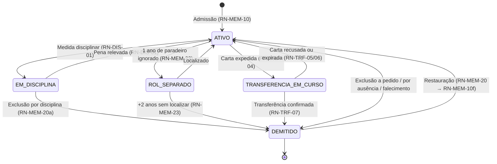
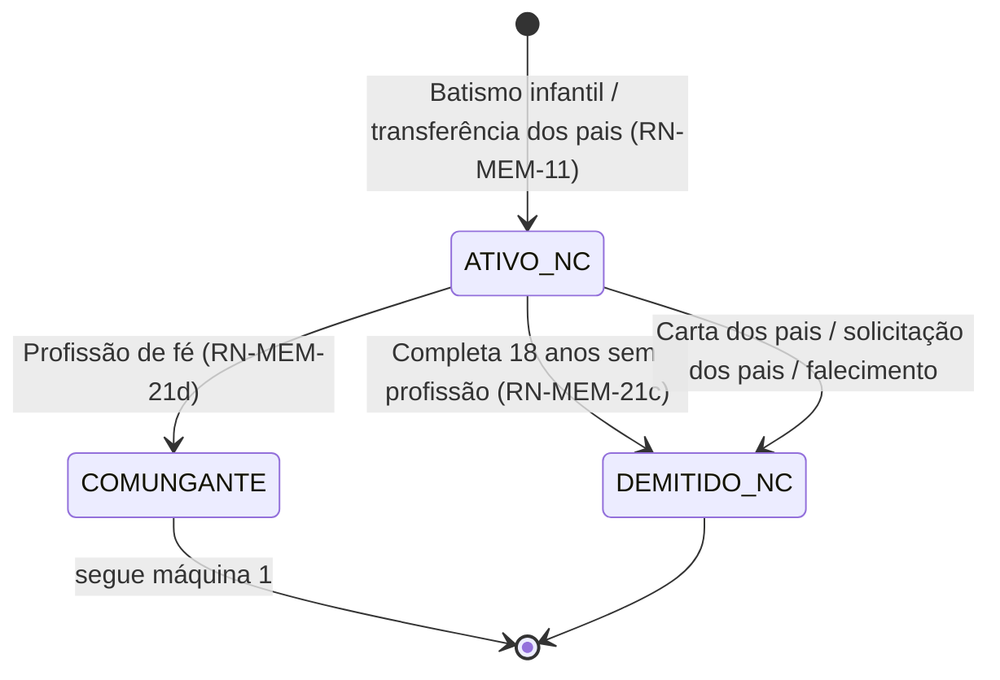
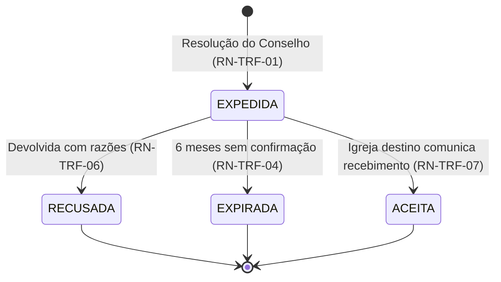
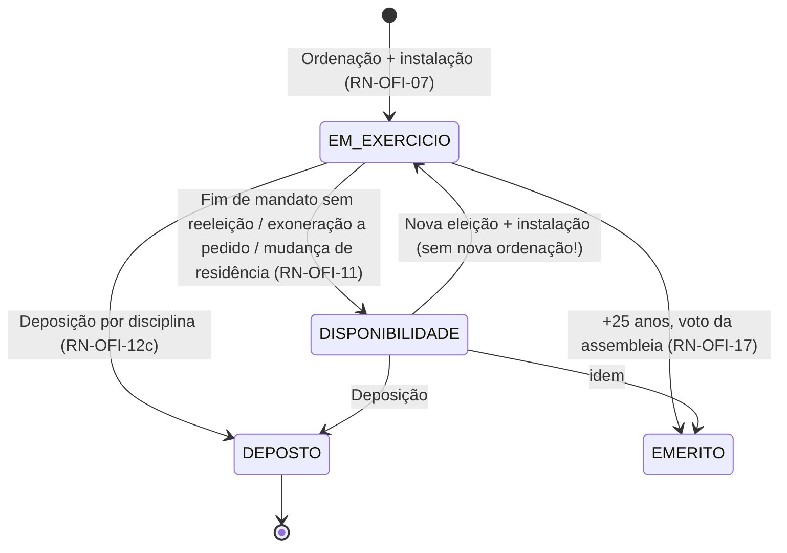
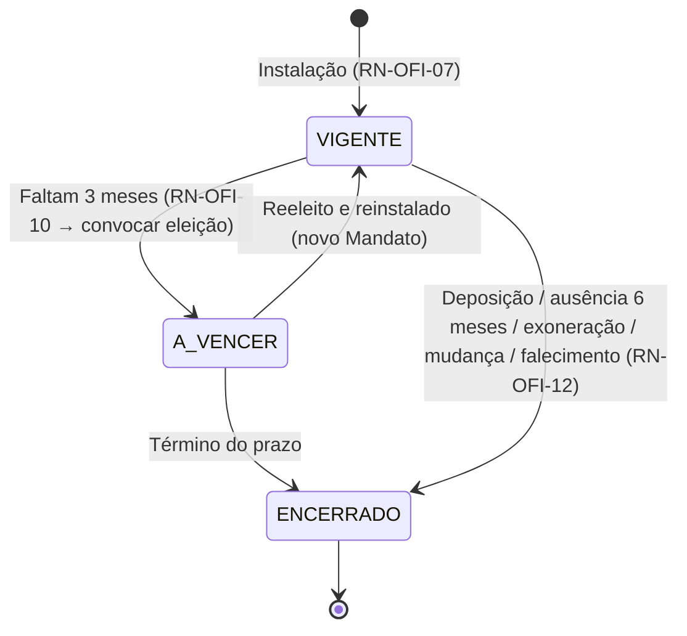
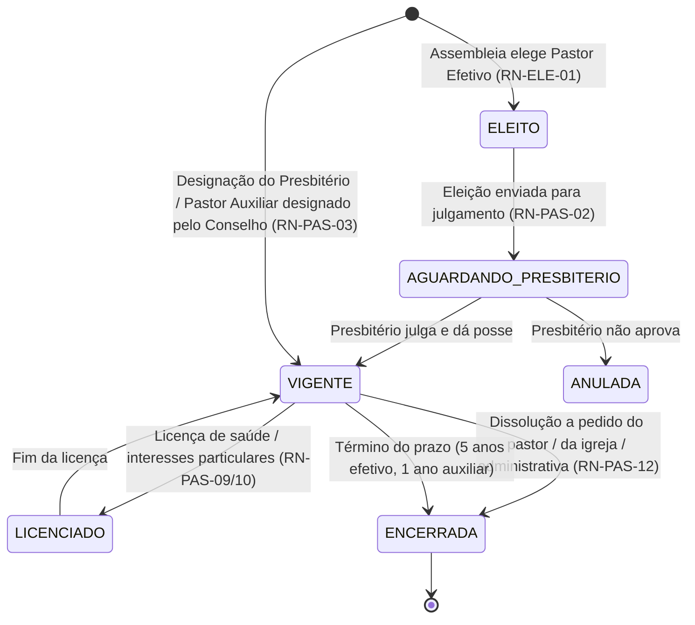
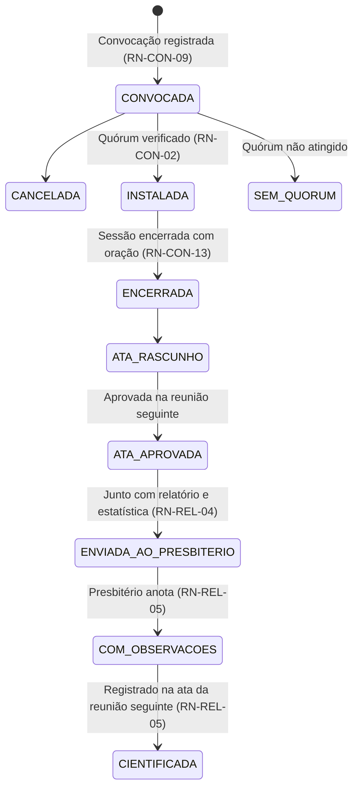
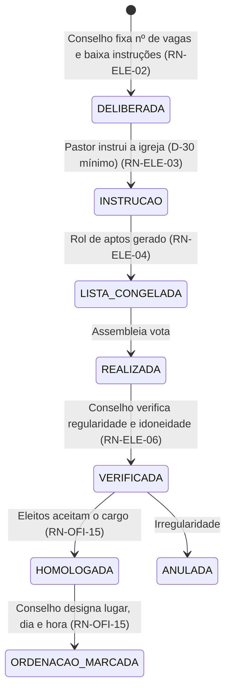
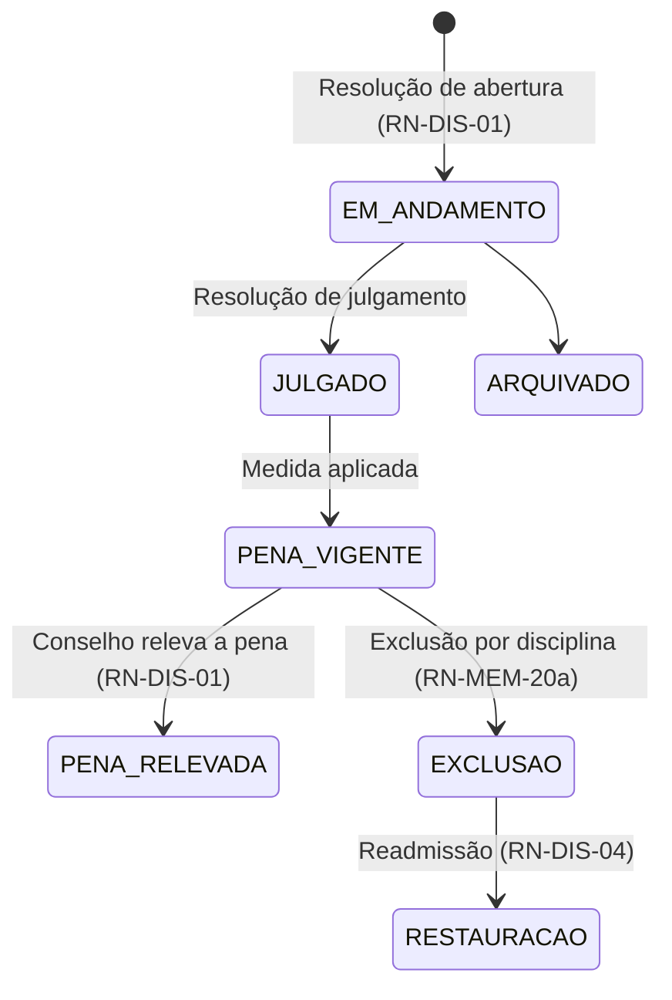

# 05 — Máquinas de estado

Ciclos de vida das entidades cuja mudança de estado a CI/IPB regula. Cada transição indica o **ato que a autoriza** e a regra `RN-XX-00`.

Princípio geral: **transição só ocorre por evento registrado, e evento só existe se houver `Resolucao`** — exceto os automáticos por decurso de prazo, que o sistema propõe e o Conselho homologa.

---

## 1. Membro comungante

**Regras críticas**
- `TRANSFERENCIA_EM_CURSO` **conta no rol** e nas estatísticas. O membro só sai quando a igreja de destino confirma (RN-TRF-05). Esse é o erro nº 1 dos sistemas de igreja: dar baixa na emissão da carta.
- `EM_DISCIPLINA` e `ROL_SEPARADO` **suspendem** `emPlenaComunhao` → a pessoa some das listas de aptos a votar, da Ceia e da elegibilidade (RN-DIS-07).
- Transição para `TRANSFERENCIA_EM_CURSO` é **proibida** se houver `ProcessoDisciplinar` em andamento (RN-MEM-22).
- `ROL_SEPARADO` e a exclusão subsequente são propostos pelo sistema por decurso de prazo, mas **efetivados por resolução** do Conselho.

---

## 2. Membro não comungante

**Alertas obrigatórios** (RN-MEM-25):
- **17 anos e 6 meses** → avisar o Conselho e o pastor: candidato a profissão de fé antes da baixa automática.
- **18 anos** → propor demissão por maioridade; se professar fé antes, executar o par `Demissao(PROFISSAO_FE)` + `Admissao(PROFISSAO_FE)` numa transação só.

---

## 3. Carta de transferência (expedida)

- Só `ACEITA` dispara `Demissao(CARTA_TRANSFERENCIA)`.
- `RECUSADA` **exige** o campo `razoesRecusa` preenchido (RN-TRF-06) e devolve o membro a `ATIVO`.
- Alerta em D-30 da validade.

---

## 4. Ofício (perpétuo) vs. Mandato (temporário)

**A distinção mais importante do modelo** (RN-OFI-02). Duas máquinas rodando em paralelo sobre a mesma pessoa.

### 4a. Ofício

- Em `DISPONIBILIDADE` a pessoa **continua sendo presbítero** e pode, quando convidada, distribuir a Ceia e participar de ordenações (RN-OFI-11). Não é ex-presbítero.
- `EMERITO` **não impede** exercício: se reeleito, acumula (RN-OFI-17).
- Presbítero emérito não reeleito assiste ao Conselho **sem voto** (RN-OFI-18) → afeta cálculo de quórum: entra na presença, não na base de votos.

### 4b. Mandato

- `dataTerminoPrevisto - dataInstalacao ≤ 5 anos` (RN-OFI-09) — validação dura.
- Transição automática para `A_VENCER` em D-90 dispara a tarefa "convocar eleição" (RN-OFI-10).
- Cessação por ausência (RN-OFI-12 *d*) é **calculada** a partir de `Presenca`: 6 meses consecutivos de `AUSENTE_NAO_JUSTIFICADO` nas reuniões do órgão. O sistema **sinaliza**; quem declara a cessação é o Conselho, por resolução.

---

## 5. Relação pastoral

- `AGUARDANDO_PRESBITERIO` é estado real e frequentemente longo — a igreja elege, o Presbitério homologa e empossa (RN-PAS-02). Não pule esse estado.
- Durante `LICENCIADO`, o pastor **continua sendo Presidente do Conselho** salvo substituição expressa; a presidência das reuniões passa por RN-CON-07.
- Ausência > 10 dias sem licença do Conselho é irregularidade a sinalizar (RN-PAS-07).

---

## 6. Reunião de concílio

**Validações no momento de instalar**
- Sem `Convocacao` a todos os presbíteros em exercício → **bloquear**, reunião é ilegal (RN-CON-09).
- Quórum espiritual: pastor + ≥1/3 dos presbíteros, mínimo 2 presbíteros (RN-CON-02).
- Quórum administrativo: maioria dos membros do Conselho (RN-CON-04) — checar **por resolução**, conforme `naturezaMateria`, não por reunião.
- Sem ministro presidindo → permitir apenas se `presidenciaAdReferendum = true` **e** nenhuma resolução for de admissão, transferência ou disciplina (RN-CON-06).
- Regime excepcional do Art. 76 §1º (1 pastor + 1 presbítero, igreja com ≤3 presbíteros) marca todas as resoluções como `adReferendum`.

---

## 7. Eleição

- `LISTA_CONGELADA` é obrigatória e imutável (RN-ELE-04). Auditoria futura depende disso.
- Para Pastor Efetivo, após `HOMOLOGADA` o fluxo continua na máquina 5, em `AGUARDANDO_PRESBITERIO`.
- Eleito que **não aceita** o cargo não gera ordenação (RN-OFI-15 + RN-OFI-05: ninguém é constrangido a aceitar).

---

## 8. Processo disciplinar (esqueleto)

⚠️ **Não detalhar mais que isto sem o Código de Disciplina em mãos.** O rito (libelo, defesa, testemunhas, recursos) está lá, não na Constituição. Ver doc 07, decisão C2.

**Efeito colateral obrigatório**: `EM_ANDAMENTO` bloqueia carta de transferência e exclusão a pedido (RN-DIS-02); `PENA_VIGENTE` com `suspendePlenaComunhao` derruba `emPlenaComunhao` (RN-DIS-07).

---

## Tabela-resumo de gatilhos automáticos

O sistema **propõe**; o Conselho **decide**. Nenhuma dessas transições deve executar sozinha.

| Gatilho | Quando dispara | Ação sugerida | Regra |
|---|---|---|---|
| Não comungante fazendo 18 anos | D-180 e D-0 | Convidar à profissão de fé / propor baixa | RN-MEM-21 *c* |
| Paradeiro ignorado | 1 ano | Propor rol separado | RN-MEM-23 |
| Rol separado | +2 anos | Propor exclusão por ausência | RN-MEM-23 |
| Carta expedida | D-30 da validade | Cobrar confirmação da igreja destino | RN-TRF-04 |
| Carta expedida | D+180 | Marcar expirada, devolver membro ao rol | RN-TRF-04/05 |
| Mandato de oficial | D-90 do término | Convocar eleição | RN-OFI-10 |
| Ausência em reuniões | 6 meses consecutivos não justificados | Sinalizar cessação de ofício | RN-OFI-12 *d* |
| Relação pastoral | D-180 do término | Deliberar reeleição ou dissolução | RN-PAS-02 |
| Reunião do Conselho | 90 dias sem reunião | Alertar descumprimento da periodicidade | RN-CON-08 |
| Mesa do Conselho | Virada do ano | Convocar eleição anual da Mesa | RN-CON-11 |
| Assembleia ordinária | Sem assembleia no ano | Alertar obrigação anual | RN-ASM-02 |
| Relatório anual | Início do exercício | Gerar relatório + estatística | RN-REL-03/04 |
| Resolução *ad referendum* | Próxima reunião | Incluir na pauta para referendo | RN-CON-03 |
| Oficial atingindo 25 anos de serviço | D-0 | Sugerir título de emérito à assembleia | RN-OFI-17 |
